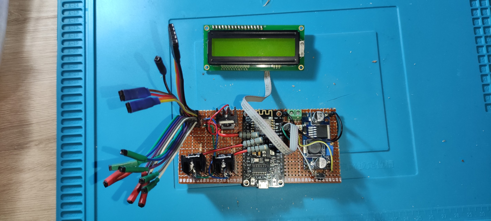

# 💡   Home Assistant controlled NodeMCU Smart Floor Lamp Project

An intelligent, DIY RGB lighting system powered by **NodeMCU (ESP8266)** and seamlessly integrated into **Home Assistant** via **MQTT Discovery**. This project features sound-reactive modes, automated sunset transitions, and a physical LCD status display.

---

## 📖 Project Overview

This project transforms a standard analog RGB LED strip into a fully automated smart home device. Unlike basic setups, this system uses **MQTT Discovery**, meaning it automatically appears in Home Assistant as a "Device" with all its entities (light, mode selector, and sensors) pre-configured.

### Key Features
* **Home Assistant Integration:** Full control over color, brightness, and modes.
* **Sound-Reactive Mode:** Real-time lighting effects synced to music/ambient sound using a MAX9814 microphone with a software-defined noise gate.
* **MQTT Discovery:** Zero-config integration for Home Assistant.
* **Physical Dashboard:** 16x2 LCD display showing the current connection status and active lighting mode.
* **Automated Cycles:** Designed to support sunset/sunrise fading and midnight auto-off routines.

---

## 🛠 Bill of Materials (BOM)

| Component | Qty | Function |
| :--- | :--- | :--- |
| **NodeMCU (ESP8266)** | 1 | Main microcontroller with WiFi connectivity. |
| **MAX9814 Microphone** | 1 | Sound detection with Auto Gain Control. |
| **RGB LED Strip (Analog)** | 1 | Main lighting unit. |
| **IRLB8721 MOSFETs** | 3 | PWM control for Red, Green, and Blue channels. |
| **16x2 LCD Display + I2C** | 1 | System status and mode visualization. |
| **LM2596 Buck Converter** | 1 | Steps down 12V supply to 5V for the NodeMCU. |
| **12V 5A Power Supply** | 1 | Powers the LED strip and the entire circuit. |
| **100 Ohm Resistors** | 3 | Gate resistors to protect NodeMCU GPIO pins. |
| **10K Ohm Resistors** | 3 | Pull-down resistors for MOSFET stability. |
| **100uF Capacitor** | 1 | Power filtering for the microphone module. |

---

## 🚀 Getting Started

1.  **Hardware:** Follow the wiring logic using the MOSFETs for PWM control. Ensure a common ground between the 12V and 5V rails.
2.  **Firmware:** * Update `STASSID` and `STAPSK` in the code with your WiFi credentials.
    * Configure your MQTT broker details.
    * Ensure the `PubSubClient` buffer size is set to `1024` for Discovery messages.
3.  **Home Assistant:** Once the NodeMCU connects to your broker, the "Smart Floor Lamp" will automatically appear under your MQTT Integration.

---

## 🔌 Circuit & Wiring

Here is the physical wiring and component layout for the project:

*Note: Ensure common ground between the 12V LED power supply and the NodeMCU.*

---

## 📝 Detailed Journey & Build Log

For a deep dive into the hardware challenges (like fixing LCD "Zebra Strips"), software logic, and advanced Home Assistant automation YAMLs, check out the full blog post:

🔗 **[A Hardware Journey: Building an Intelligent RGB Lamp](https://www.recnes.com/a-hardware-journey-building-an-intelligent-rgb-lamp-with-nodemcu-and-home-assistant)**

---

## 🤝 Contributing
Feel free to fork this project, report issues, or submit pull requests to improve the lighting modes or automation logic!

## 📜 License
This project is open-source and available under the MIT License.
